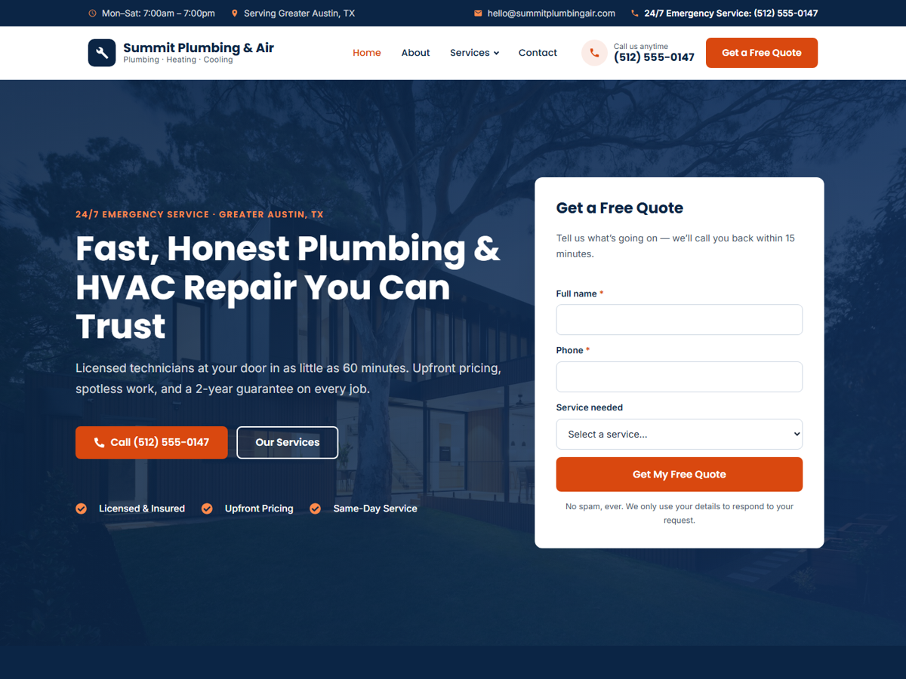

# Summit Services: Local Service Business Website (WordPress + Elementor)

A complete website for a plumbing / HVAC company (demo brand: **Summit Plumbing & Air**, Austin TX).
You can rebrand it for roofing, electrical or any other local service.



**Built with:** WordPress · Elementor (free) · custom PHP theme · vanilla JS (no jQuery)

## What's included

| Requirement | Where it lives |
|---|---|
| Home | Elementor page: hero with quote form, stats, 6 service cards, why-us, process, reviews, service area + map, CTA |
| About | Elementor page: story, stats, values, credentials, reviews, CTA |
| Services | Elementor page: service grid, process, FAQ, CTA |
| Service detail pages (x6) | Child pages of Services: overview, what's included, warning signs, FAQ, sticky sidebar CTA |
| Contact | Elementor page: contact details, full quote form, full-width Google Map |
| Header / footer | Theme (`header.php`, `footer.php`): top bar, sticky header, dropdown menu, 4-column footer |
| Contact form | `[summit_contact_form]` shortcode: emails you **and** saves every request under **Dashboard → Leads** |
| Mobile responsive | Hamburger menu, stacked layouts, sticky **Call Now / Free Quote** bar on phones |
| CTA buttons | Header, hero, every card, every page's closing CTA band, mobile call bar |
| Google Maps | Elementor Google Maps widget (Home + Contact), no API key needed |

## Install

1. Zip the `summit-services` folder, or copy it into `wp-content/themes/`.
2. WordPress admin → **Appearance → Themes → Add New → Upload Theme** → choose the zip → **Activate**.
3. Install and activate the free **Elementor** plugin (Plugins → Add New → search "Elementor").
4. *(Optional, recommended)* **Appearance → Customize → Business Info**: enter your real phone, email, address, hours and the email that should receive quote requests.
5. **Appearance → Summit Setup** → **Import Website**.

That's it. The import creates all 10 pages, sets Home as the front page, builds the menus, turns on pretty permalinks, loads the photos into the Media Library and sets your brand colors and fonts in Elementor Site Settings.

## Editing

- **Page content:** Pages → hover a page → **Edit with Elementor**. Every section is a standard, free Elementor widget.
- **Logo:** Appearance → Customize → Site Identity.
- **Phone / email / address / hours:** Appearance → Customize → Business Info. The header, footer and form update right away. To push new details into the Elementor page content (buttons, map), re-run **Summit Setup**.
- **Brand colors / fonts:** Elementor → Site Settings → Global Colors / Global Fonts (primary = navy, accent = orange). Theme header/footer colors live at the top of `style.css`.
- **Leads:** Dashboard → Leads. On local installs email usually isn't configured, so check Leads there. On live hosting, install an SMTP plugin (e.g. WP Mail SMTP) for reliable delivery.

> ⚠️ Re-running the import **resets the 10 demo pages** to the original design. It never touches your other pages.

## Replace before going live

- Business name, phone, license numbers, address (Customizer + Summit Setup)
- Testimonials, stats (25+ years, 12,000+ jobs…) and credentials are **sample content**
- Photos are from Unsplash (free for commercial use). Swap in real team/job photos for best results.

## File map

```
summit-services/
├── style.css               theme header + all styles (design tokens at top)
├── functions.php           setup, assets, Elementor support
├── header.php / footer.php site chrome
├── page.php / index.php / 404.php
├── assets/js/main.js       mobile menu, submenus, sticky header
├── assets/images/          demo photos (imported by Summit Setup)
└── inc/
    ├── customizer.php      Business Info settings
    ├── contact-form.php    quote form shortcode + Leads post type
    ├── elementor-helpers.php  builds Elementor sections/widgets in PHP
    ├── demo-content.php    page layouts + service copy (edit services here)
    └── demo-import.php     Appearance → Summit Setup
```

To change which services exist, edit `summit_demo_services()` in `inc/demo-content.php` and re-run the import.

## License & credits

- Theme code: [GPL-2.0-or-later](LICENSE), the same license as WordPress.
- Photos: [Unsplash](https://unsplash.com) (Unsplash License).
- Summit Plumbing & Air is a fictional company. All names, phone numbers, reviews and license numbers are sample content.
